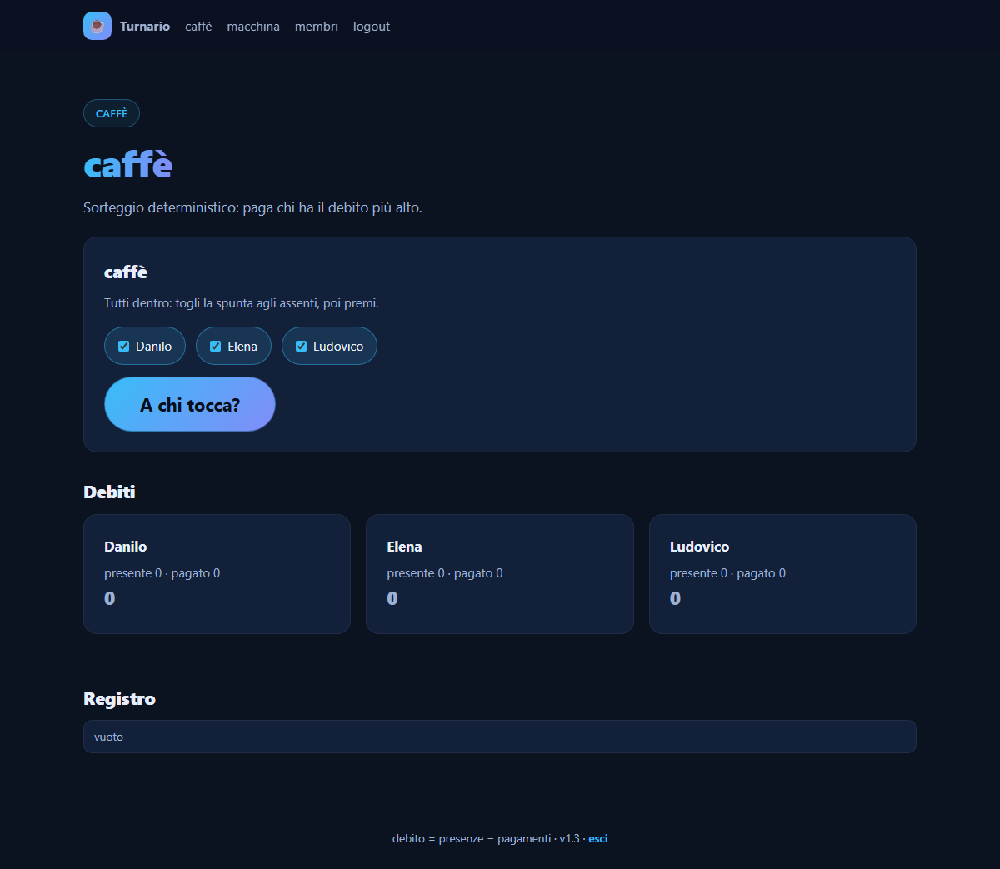

# ☕ Turnario

**Chi paga il caffè? Chi prende la macchina?** Un registro di gruppo, deterministico e condiviso.



## Come funziona

- Un gruppo ha due registri: **caffè** e **macchina**.
- Per ogni giorno si registrano i presenti; il sorteggio decide **chi paga**.
- `debito = presenze − pagamenti`, cumulativo e senza reset: paga chi ha il debito più alto. In caso di parità, sorteggio casuale.
- Il risultato è **identico per tutti** chi apre la pagina: non è un sorteggio "a richiesta", è una funzione del registro.
- Login con PIN (4 cifre, per utente), cookie di sessione, limitazione dei tentativi.
- Notifica Telegram quando un turno viene registrato.
- Un amministratore globale crea gruppi e utenti, rinomina, archivia, elimina, cambia PIN.

## Requisiti

Solo **stdlib Python 3** — nessuna dipendenza, nessun framework, un unico file `app.py`.

## Run locale

```bat
start.bat
```

oppure:

```bash
python app.py --port 8080 --db turnario.db
```

Creare l'amministratore:

```bash
python app.py --admin admin "PIN" --db turnario.db
```

Self-check (test senza toccare il DB di produzione):

```bash
python app.py --test
python app.py --version
```

## Versione e changelog

La versione è in fondo a ogni pagina e su `/changelog`. Ogni modifica visibile agli utenti ha una entry in [`CHANGELOG.md`](CHANGELOG.md).

## Struttura

| file | ruolo |
|---|---|
| `app.py` | tutto: schema, sorteggio, auth, Telegram, HTML/CSS, test |
| `CHANGELOG.md` | changelog servito su `/changelog` |
| `start.bat` | launcher locale |

Il codice è in inglese; solo le stringhe mostrate agli utenti sono in italiano.

## Licenza

[MIT](LICENSE)
